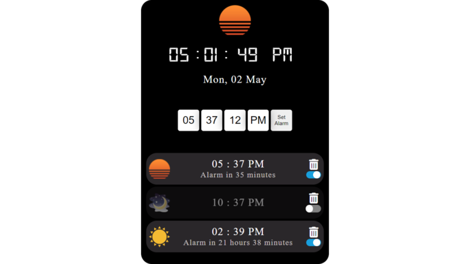
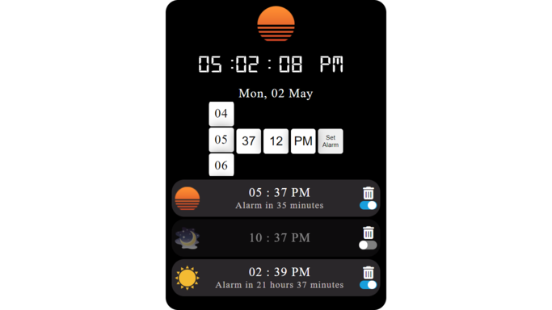
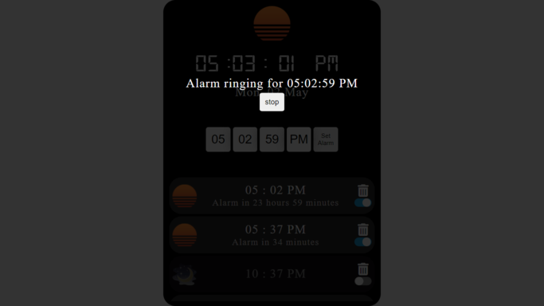
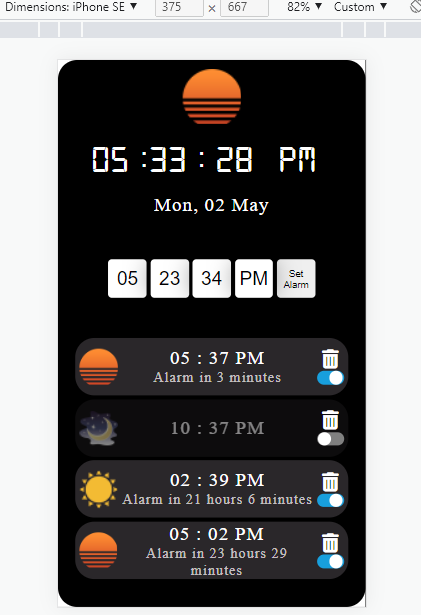
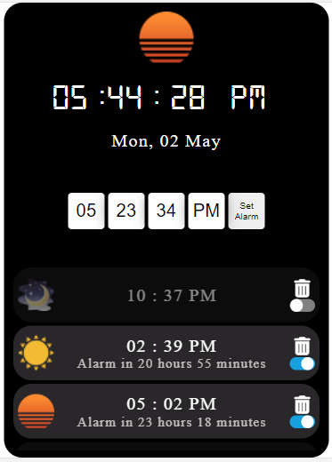
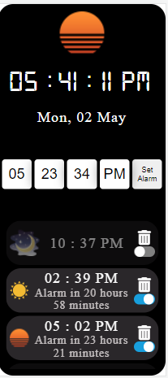

# alarm-clock.github.io

# Alarm Clock

This Project shows running digital clock which shows user current date and time .
This Project also includes interactive alarm features such as 
user can set multiple alarms and delete any of them at any time period. They can also make any alarm active or inactive that is on or off at any interval of time .

## Demo

[Demo](https://abhaykmr01.github.io/alarm-clock.github.io/)
## Features

- Shows current Time And Date as well as image for that Part of the day
- Multiple Alarm List
- Alarm List displayed are in Sorted order 
- Adding a new Alarm to the list rearranges the alarm list displayed based on how close they are from current time
- Each Alarm List contains different  image for that particular part of day.
- Each Alarm List contains delete and on/off button.
- The delete button deletes the Alarm from the list.
- ON/OFF button or toggle button makes that particular alarm active or inactive for the ringing.
- Each Alarm list displays the time remaining for the alarm to go off .

## 🛠 Skills
Javascript, HTML, CSS...

## Screenshots

